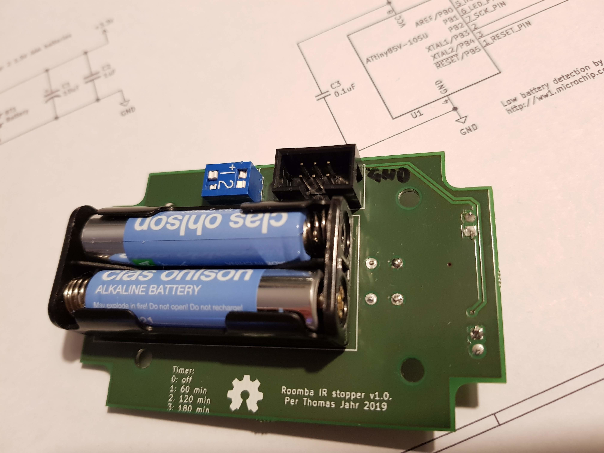
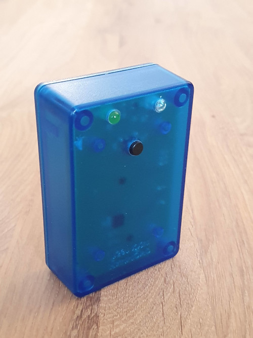
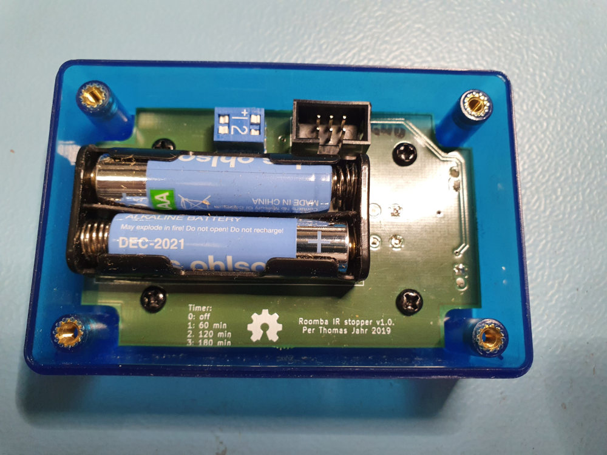
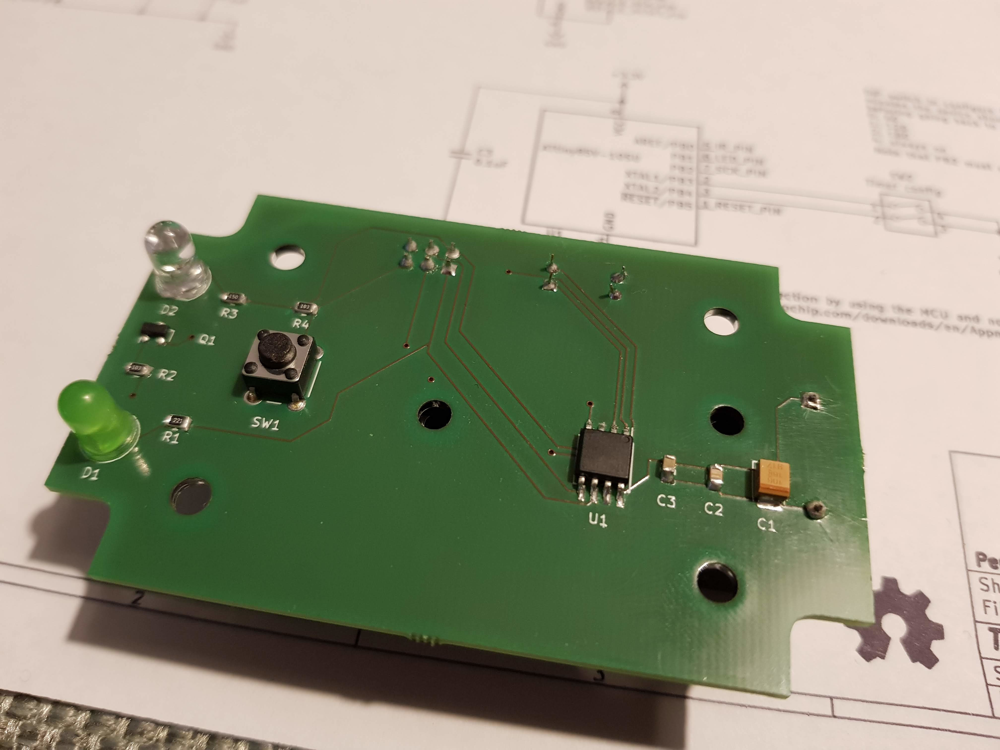

# IR Beacon for Roomba

Quick links: [Schematic](https://perja12.github.io/roomba_beacon/kicad/ir_beacon/ir_beacon.pdf) | [Interactive BOM](https://perja12.github.io/roomba_beacon/kicad/ir_beacon/bom/ibom.html)

This project describes an IR beacon that can be used with certain Roomba vacuum cleaners. The beacon can be used to prevent the vacuum cleaner from entering a room or other off-limit zones. The vacuum cleaner will simply turn around when it receives the infrared light emitted from the beacon.

The project is inspired by a similar project from http://gregthielen.me/blogstuff/2017/06/27/roomba-virtual-wall/ and the timings for IR LED is taken directly from that page.

## Design

The circuit itself is simple enough; when the push button is pressed, the IR LED will flash in a given pattern. To save battery the duration is limited to one hour (configurable). In addition there is a green indicator LED that will flash once when the device is turned on and twice when turned off.

An ATtiny85V is used without any voltage regulator as it can operate with a voltage from 1.8 to 5.5V. The device is powered by two AAA alkaline batteries and the battery holder is soldered to the PCB. As the ATtiny85 have maximum current of 40 mA per pin and the IR LED (Vishay TSAL4000) has a forward current of 100 mA, we will need a transistor (MMBT3904) to switch the IR LED.

# Power consumption

There are two modes of operation:

1) Sleep mode: the IR LED is off and the MCU is in deep sleep. The current consumption is a couple of uA.

2) The average current consumption during active mode (when blinking the IR LED) is about 3.3 mA and can be lowered by using SLEEP_IDLE to save power and wake up when 132 ms have passed.

# Push button on/off switch

The circuit uses a power latch implemented by using special instructions that skips resetting a particular variable to zero during reset (see the _power_ variable in the code).  The push button is connected to the RESET pin and when pressed it will reset the MCU. The setup function toggles the _power_ variable and the circuit either goes to sleep or starts blinking the LED. With such a design it is important to have low sleep current. The solution is described here: http://www.technoblogy.com/show?VOO.

# Configurable on-duration

Depending on the route the vacuum cleaner chooses one can decide how many hours the device will be on. The user can configure this by setting two DIP switches. The duration is measured by using the number of milliseconds since the device was reset. The accuracy of this timer is not very good and can be off by several minutes. But for this purpose it works well enough.

# Detect low battery (not implemented)

On start up the indicator LED will blink rapidly if it is time to replace the batteries (around 2V). This is implemented by setting the internal reference voltage as ADC input and the target VCC as the ADC reference. The solution is described in this application note from Microchip: http://ww1.microchip.com/downloads/en/Appnotes/00002447A.pdf

# How to build

Install the ATTinyCore and use the following settings in the Arduino IDE

* Uses ATTinyCore: https://github.com/SpenceKonde/ATTinyCore
* 8 MHz internal clock
* B.O.D. disabled to save power

There is also a Makefile that uses [arduino-cli](https://www.arduino.cc/pro/cli).

# Enclosure

The PCB is designed so that it fits the Hammond 1591 ABS multipurpose enclosure and can be mounted directly without any standoffs. Only three additional holes are needed. Using one of the transparent boxes makes it easy to see where to drill. Note that there is a slight angle on the sides so the box wont stand exactly at 90 degrees, but close enough.

# Improvements

List of improvements that can be done:

* Clean up the layout and make it more compact.
* Replace delay in code with timers.
* Blink the LED now and then to show that it is on.

# Images

